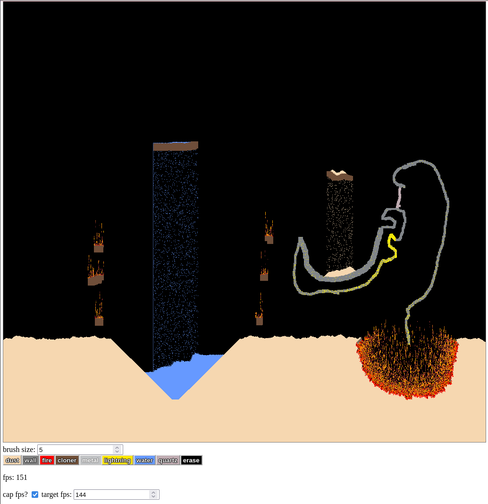

# sand game shader

fragment shader that implements falling particles similar to ['falling sand
game'](https://boredhumans.com/falling_sand.php), but using the GPU to achieve
better performance with more particles.

a lot of the code's structure comes from [this blog post](https://nullprogram.com/blog/2014/06/10),
which describes how to set up a simulation using webgl fragment shaders.
